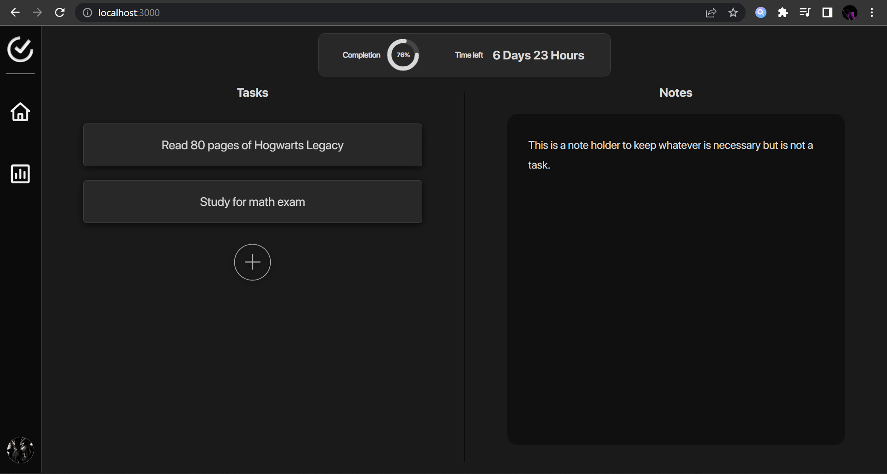
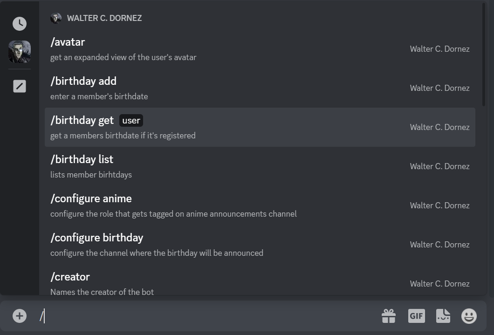

<h1 align="center">Welcome to my profile.</h1>

Hello, I am **Me3za**, an entry-level programmer that's eager to begin my journey in the world of software development, as well as apply the knowledge I have gained through my education. I am proficient in the following domains:

- **Can write a full-stack MERN (MongoDB ExpressJS ReactJS Node) SPA**

  - 
    
    
    
    .

- Can write good scripts with .
- Can write fast programs that solve complicated issues with .
- Familiar with development in Node.js and using **npx**, **nvm** and **npm**.
- Javascript libraries:

  | axios    | cron    | discord.js     | dotenv  | jimp     | jsonwebtoken | cors |
  | -------- | ------- | -------------- | ------- | -------- | ------------ | ---- |
  | mongoose | teemoJS | twitter-api-v2 | express | mongoose | bcrypt       | sass |

- Familiar with **macOS**, **Ubuntu/Debian** and **Windows 10/11**.
- Good knowledge of the **Unix** philosophy and systems.
- Well acquainted with .

My best qualities / Reasons why you would want to work with me are the following:

- A remarkably good work ethic.
- I critically think about all my developmental decisions.
- I am very rigorous in how I write my code and how I document it.
- Can speak/write very eloquent English and can speak/read/write French and Arabic.
- Can communicate my ideas and thoughts very well. And can also work with most people with no issues.

My goal is to constantly improve and learn from experienced professionals.

---

## **Here's a snippet of the projects I'm working on right now.**

**A productivity app:** [Learn more.](https://github.com/me3zaAKAgoat/dtb)

**An in-house discord bot:** [Learn more.](https://github.com/me3zaAKAgoat/Walter-Bot)

---

# Contact me at medkrix1@gmail.com.
