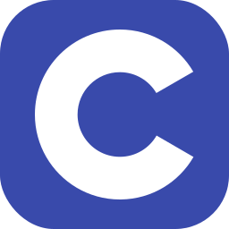

## Hey there

I'm <b>Me3za</b>. Currently, I'm a computer science student with about four years of programming experience. I specialize in building websites and Discord bots. Feel free to reach out if you're interested in working together on something cool!

#### Frameworks/Libraries

#### Programming/Markup Languages

#### Systems Level Programming

#### Preferred development tools

