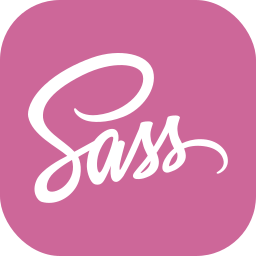

<b><samp>「</samp></b>

<samp>
Hey, I'm <b>El Mehdi Choukri</b>, and I go by <b>Me3za</b> online.  I've been programming for about about four years now, and I've learned a lot  about different programming languages and technologies along the way.  I'm always open to teaming up on new projects,  so hit me up if you want to work on something cool together!
</samp>

<b><samp>」</samp></b>

<samp>

<h3>Web Technologies</h3>

<h3>Bots/Scripting</h3>

<h3>Low level programming</h3>

<h3>Preferred development tools</h3>

---

## **A productivity app I'm currently working on:** [pogtracker.live](http://pogtracker.live)

---

## Contact me at medkrix1@gmail.com.

</samp>
